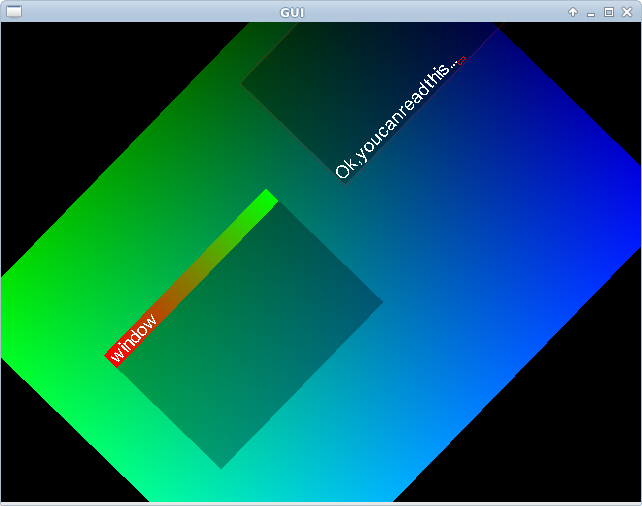

Xx
==

experimentation with OCaml and OpenGL.
I recently was browsing my personal archives and found my very first OCaml weekend project. I tried to get to compile again, and after some fiddling, got it to work with _glMLite_. I put it here in case someone wants to play with this too. 

A word of caution: Back then (somewhere around 2007) I was still in OO-mode, and the code shows it.

Obligatory Screenshot
---------------------

Compiling:
==========

You need opam installed with _lablgl_ and _glMlite_.

    
    > make

License:
========

You can use this any way you want as long as your organization employs less 
than 2 lawyers.

have fun,

Romain.

